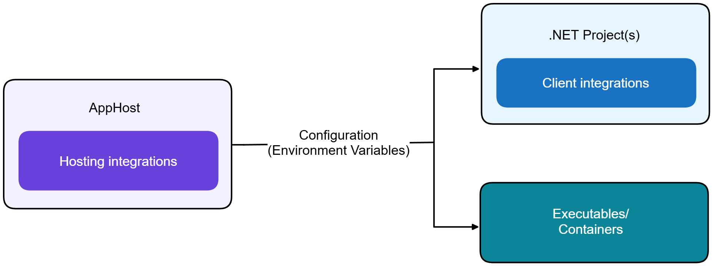
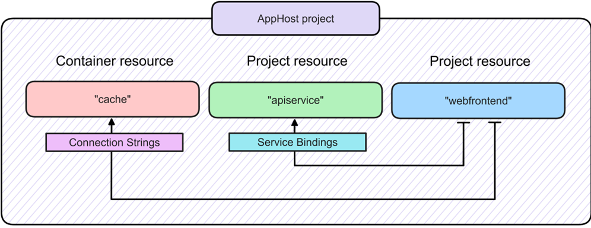
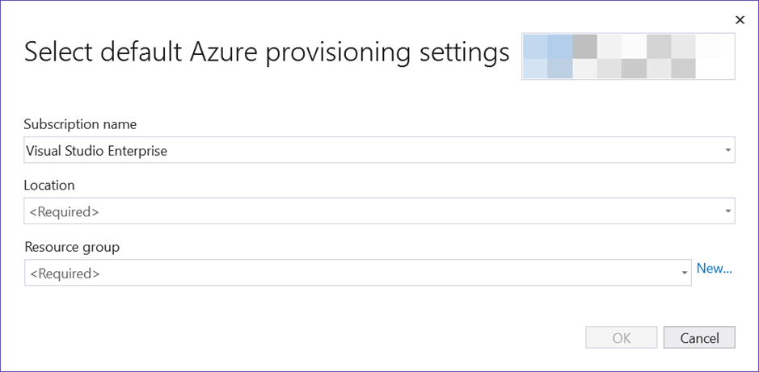
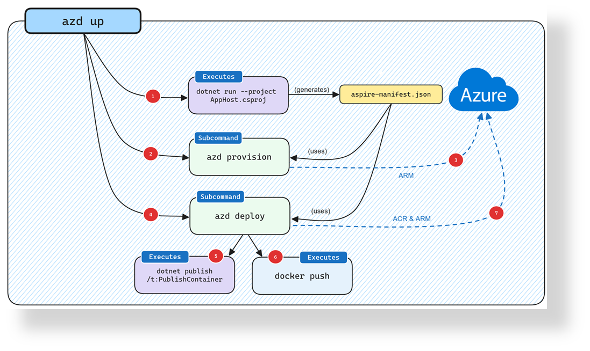

<!-- _footer: 'https://github.com/codebytes/build-with-aspire' -->

# Aspiring .NET with Azure OpenAI

## Chris Ayers


---


## Chris Ayers

### Senior Customer Engineer<br>Microsoft

<i class="fa-brands fa-twitter"></i> Twitter: @Chris_L_Ayers
<i class="fa-brands fa-mastodon"></i> Mastodon: @Chrisayers@hachyderm.io
<i class="fa-brands fa-linkedin"></i> LinkedIn: - [chris\-l\-ayers](https://linkedin.com/in/chris-l-ayers/)
<i class="fa fa-window-maximize"></i> Blog: [https://chris-ayers\.com/](https://chris-ayers.com/)
<i class="fa-brands fa-github"></i> GitHub: [Codebytes](https://github.com/codebytes)

---


# Agenda

- Why .NET Aspire?
- .NET Aspire Integrations
- Consuming Resources
- Local Azure Development
- Deploying to Azure
- Demos
- Q&A

---

# <!-- fit --> .NET Aspire is designed to improve the<br> experience of building .NET cloud-native apps.

---

# Why .NET Aspire

<div class="columns3">
<div>

## Orchestration

</div>
<div>

## Integrations

</div>
<div>

## Tooling

</div>
</div>

---

# Orchestration

<div class="columns">
<div>

- Automated Service Management
  - Orchestrate the start and stop of multiple services, ensuring smooth coordination across microservices  and background jobs.
- Centralized Configuration
  - Automatically manage keys, connection strings, and credentials, injecting them into services without manual handling.

</div>
<div>

- Integrated Logging and Monitoring
  - Built-in support for logging, monitoring, and debugging across all services, making troubleshooting and performance tuning easier.
- Multi-Container Orchestration
  - Run and coordinate multiple containers in parallel or sequence, streamlining complex setups like databases, APIs, and AI services.

</div>
</div>

---

# Integrations

- Seamless Azure Service Integration
- Local Emulators and Container Support
- Built-in Authentication and Authorization
- Simple Integration

---

# Tooling

- Visual Studio and Visual Studio
- Code Integration
- Project Templates
- .NET Aspire Dashboard
- .NET Aspire App Host
- .NET Aspire Service Defaults

---

# .NET Aspire Integrations



---

# The Two sides to .NET Aspire Integrations

<div class="columns">
<div>

## Hosting Integrations

- Provision and manage resources
- Automate infrastructure setup
- Cloud-native functionality
- Integrated logging and monitoring
- Authentication and authorization
- Configuration management

</div>

<div>

## Client Integrations

- Configure service connections
- Consume hosted services
- Service discovery
- Service defaults
- Integrated logging and monitoring

</div>
<div>

---

# Project Level Integrations

- Node
- Python
- Docker
- .NET Projects

---

# Integrations

<div class="columns">
<div>

- AI:
  - Azure OpenAI
  - Azure AI Search
  - Ollama
- Databases:
  - PostgreSQL
  - SQL Server
  - MySQL
  - MongoDB
  - Cosmos DB
  - Redis

</div>
<div>

- Messaging:
  - Azure Service Bus
  - RabbitMQ
  - Kafka
  - Azure Event Hubs
- Storage:
  - Azure Blob Storage
- Monitoring and Logging:
  - Azure Monitor
  - Application Insights
  - OpenTelemetry

</div>
</div>

---

# Consuming Resources

---

# Fundamentals

- Service Discovery
- Service Defaults
- .NET Aspire and Launch Profiles
- Health Checks
- Telemetry

---

# Service Discovery and Configuration



---

# Service Discovery and Configuration

- Service Discovery Configuration: .NET Aspire configures service discovery during development and testing by passing necessary configuration from the AppHost project to individual service projects.
- Implicit Discovery by Reference: Only services referenced in a project (e.g., frontend referencing catalog and basket) are included in service discovery.
- Named Endpoints: Services can expose multiple, named endpoints, resolved using specific URI formats like `scheme://_endpointName.serviceName`.
- Environment Variables:
  ```
  services__apiservice__http__0
  services__apiservice__myendpoint__0
  ConnectionStrings__cache
  ```

---

# Service Defaults

- Security Defaults
  - Authentication & Authorization: Pre-configured with Azure AD, ensuring secure access.
  - Secrets Management: Integrated with Azure Key Vault for secure storage of secrets and credentials.
- Resilience & Scalability
  - Retry Policies: Automatically applied to prevent transient failures.
  - Circuit Breakers: Protects services from cascading failures.
- Monitoring & Observability
  - Pre-configured for logging, tracing, and metrics collection.

---

# Local Azure Development

---

# Azure provisioning credential store

- AzureCli
- AzurePowerShell
- VisualStudio
- VisualStudioCode
- AzureDeveloperCli
- InteractiveBrowser

---

# Deploy and Configure Resources

In Visual Studio


---

# Deploying to Azure

---

# Deployment Manifest

- Deployment Manifest
- Cloud-Agnostic Deployments
- Azure Developer CLI (azd) 
- Azure Container Apps
- Telemetry with Application Insights

---

# Azure Developer CLI

Native support for deploying .NET Aspire projects.
`azd init` initializes a project by inspecting the directory structure to determine the app type.
`azd` runs the AppHost to generate the Aspire manifest file.
The generated manifest is used by azd’s provision command to create Bicep files in-memory.



---


# DEMOS

---

# Questions


---

# Resources

<div class="columns">
<div>

## Links

- [.NET Aspire](https://learn.microsoft.com/en-us/dotnet/aspire/get-started/aspire-overview)
- [Aspirify](https://aspireify.net/)
- [Aspire Samples](https://github.com/dotnet/aspire-samples)

</div>
<div>

## Follow Chris Ayers

<i class="fa-brands fa-twitter"></i> Twitter: @Chris_L_Ayers
<i class="fa-brands fa-mastodon"></i> Mastodon: @Chrisayers@hachyderm.io
<i class="fa-brands fa-linkedin"></i> LinkedIn: - [chris\-l\-ayers](https://linkedin.com/in/chris-l-ayers/)
<i class="fa fa-window-maximize"></i> Blog: [https://chris-ayers\.com/](https://chris-ayers.com/)
<i class="fa-brands fa-github"></i> GitHub: [Codebytes](https://github.com/codebytes)

</div>

</div>

<!-- Needed for mermaid, can be anywhere in file except frontmatter -->
<script type="module">
  import mermaid from 'https://cdn.jsdelivr.net/npm/mermaid@10/dist/mermaid.esm.min.mjs';
  mermaid.initialize({ startOnLoad: true });
</script>
