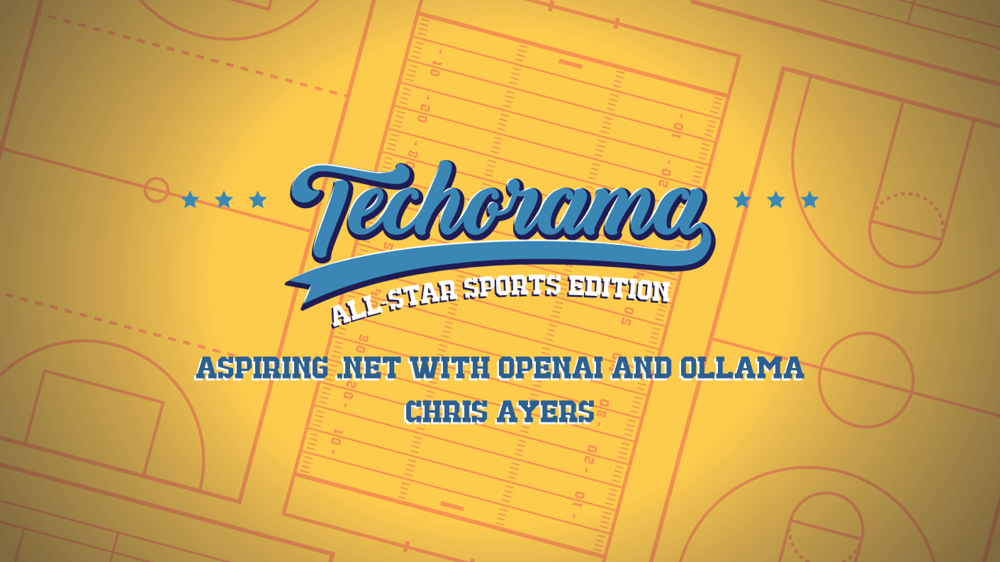
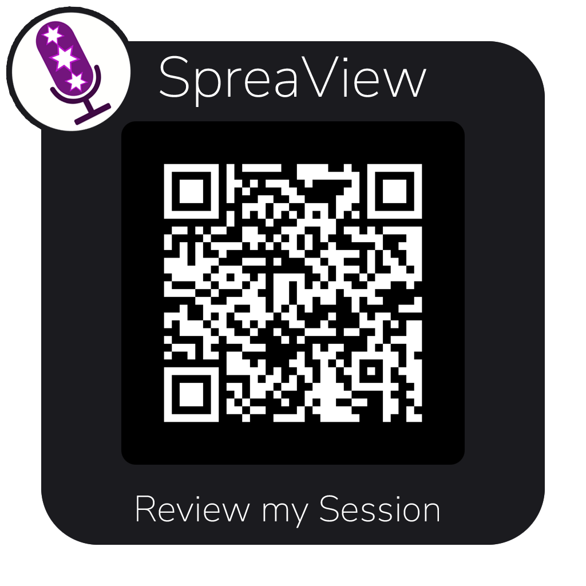

---

<!-- _footer: 'https://github.com/codebytes/build-with-aspire' -->

# Aspiring .NET with Azure OpenAI and Ollama

## Chris Ayers


---


## Chris Ayers

### Senior Risk SRE<br>Azure CXP AzRel<br>Microsoft

<i class="fa-brands fa-bluesky"></i> BlueSky: [@chris-ayers.com](https://bsky.app/profile/chris-ayers.com)
<i class="fa-brands fa-linkedin"></i> LinkedIn: - [chris\-l\-ayers](https://linkedin.com/in/chris-l-ayers/)
<i class="fa fa-window-maximize"></i> Blog: [https://chris-ayers\.com/](https://chris-ayers.com/)
<i class="fa-brands fa-github"></i> GitHub: [Codebytes](https://github.com/codebytes)
<i class="fa-brands fa-mastodon"></i> Mastodon: [@Chrisayers@hachyderm.io](https://hachyderm.io/@Chrisayers)
~~<i class="fa-brands fa-twitter"></i> Twitter: @Chris_L_Ayers~~

---


# Agenda

- Why .NET Aspire?
- .NET Aspire Integrations
- Consuming Resources
- Local Azure Development
- Deploying to Azure
- **What's New in 9.3**
- Demos
- Q&A

---

# <!-- fit --> .NET Aspire is designed to improve the<br> experience of building .NET cloud-native apps

---

# Why .NET Aspire

<div class="columns3">
<div>

## Orchestration and Fundamentals

- **Service Management**
- **Configuration**
- **Service Discovery**
- **Health & Telemetry**

</div>
<div>

## Integrations

- **Azure Services**
- **Local Development**
- **Multi-Platform**
- **Community Ecosystem**

</div>
<div>

## Tooling

- **IDE Integration**
- **Dashboard**
- **AppHost Project**
- **CLI Support**

</div>
</div>

---

# Service Defaults & Features

<div class="columns">
<div>

- **Security Defaults**
  - Azure AD authentication
  - Secure secrets management
- **Resilience & Scalability**
  - Automatic retry policies
  - Circuit breakers for failure protection

</div>
<div>

- **Custom Commands**
  - Workflow automation
  - Database migrations, data seeding
  - Development environment reset
- **Launch Profiles**
  - Multiple environments (local, cloud, test)
  - Environment variable configuration

</div>
</div>

---

# .NET Aspire Dashboard

<div class="columns">
<div>


</div>
<div>

## Dashboard Features

- **Real-time Monitoring**
- **Interactive Debugging**
- **Resource Management**
- **Secret Management**
- **Copilot AI Debugging**

</div>
</div>

---

# Service Discovery and Configuration

- **Automatic Configuration**: AppHost passes settings to services
- **Implicit Discovery**: Services reference only what they need
- **Named Endpoints**: Multiple endpoints per service
- **Environment Variables**: Structured configuration strings


---

# Testing in .NET Aspire

- **Integration Testing**: Test multiple components together
- **Container Testing**: Test with containerized services
- **Emulator Support**: Use local emulators for cloud services
- **End-to-End Testing**: Test full application workflows


---

# .NET Aspire Integrations


---

# The Two Sides to .NET Aspire Integrations

<div class="columns">
<div>

## Hosting Integrations

- Provision and manage resources
- Automate infrastructure setup
- Cloud-native functionality
- Integrated logging and monitoring
- Authentication and authorization
- Configuration management

</div>
<div>

## Client Integrations

- Configure service connections
- Consume hosted services
- Service discovery
- Service defaults
- Integrated logging and monitoring

</div>
</div>

---

# Official Integrations

<div class="columns">
<div>

## Cloud-Agnostic

- **Databases**: PostgreSQL, MySQL, MongoDB, SQL Server
- **Messaging**: Kafka, RabbitMQ, NATS
- **AI & Observability**: Ollama, Semantic Kernel, OpenTelemetry

</div>
<div>

## Cloud-Specific

- **Azure Services**: OpenAI, Cosmos DB, SQL, Redis, Key Vault, App Service, ACR, App Config
- **AWS Support**: Via Hosting.AWS package

</div>
</div>

---

# Community Toolkit Integrations

<div class="columns">
<div>

## Multi-Language Support

- **JavaScript**: Bun, Deno
- **Systems Programming**: Go, Rust
- **Enterprise**: Java/Spring
- **Extensions**: Node.js, SQL, MongoDB, Redis

</div>
<div>

## Additional Services

- **AI & Search**: Ollama, Meilisearch
- **Data**: SQLite, Data API Builder
- **Web**: Azure Static Web Apps emulator
- **Customization**: Advanced configurations

</div>
</div>

---

# Local to Cloud Integrations

| **Provider** | **Local Development** | **Cloud Production** |
|--------------|----------------------|---------------------|
| **OpenAI** | Ollama, Foundry local, LM Studio | Azure OpenAI Service, Azure AI Foundry |
| **Models** | Llama 3, Phi-4, Qwen | GPT-4o, GPT-4o-mini |
| **Embeddings** | Local embedding models | text-embedding-3-small/large |
| **Vector DB** | Qdrant, Chroma, pgvector | Azure AI Search, Cosmos DB |
| **Image Gen** | DALL-E via API | DALL-E 3 via Azure |

---

# Resource Management & Development

<div class="columns">
<div>

## Local to Cloud
- **Zero-Friction**: Seamless local to cloud transitions
- **Emulator Support**: Local containers for speed
- **Hybrid Development**: Mix local/cloud resources
- **Environment Control**: Component-level targeting

</div>
<div>

## Configuration
- **Simple Connections**: Easy Azure and third-party integration
- **Auto Configuration**: Service discovery and management
- **Secret Handling**: Secure credential management
- **Minimal Code**: Connect with just a few lines

</div>
</div>

---

# Microsoft.Extensions.AI

<div class="columns">
<div>

- **Unified API**: Common interface for AI providers
- **Pipeline Architecture**: Chain components efficiently
- **DI Integration**: Works with .NET service container
- **Provider-Agnostic**: Single interface, multiple backends

</div>
<div>

- **Local Development**: Connect to Ollama, LM Studio
- **Cloud Ready**: Same code for Azure OpenAI
- **Transport Options**: HTTP, gRPC, direct calls
- **Performance**: Auto-batching and throttling

</div>
</div>

---

# AI Local-to-Cloud Transitions

<div class="columns">
<div>

```csharp
// Local development with Ollama
builder.AddOllama("ollama")
    .WithModel("llama3");

// Add client to use the model
 builder.AddOllamaApiClient();
```

```csharp
// Single line change for production
builder.AddAzureOpenAI("ai");

// Same client code works unchanged
builder.AddAzureOpenAIClient();
```

</div>
<div>

- **Same Application Code**: Business logic remains identical
- **Configuration-Based Switching**: Environment determines provider
- **Consistent Capabilities**: Text completion, embeddings, image generation
- **Resource Integration**: Works with .NET Aspire's resource model
- **Example**: Use Ollama locally → Azure OpenAI in production

</div>
</div>

---

# Azure Deployment & Authentication

<div class="columns">
<div>

## Deployment Targets
- **Azure App Service**
- **Azure Container Apps**
- **Kubernetes**
  
## New in 9.3
- **Per-resource publishing**
- **Resource-to-compute mapping**
- **Improved CI/CD parameters**

</div>
<div>

## Authentication
- **Credential Providers**
- **Key Vault Integration**
- **Secure Access**
## Developer CLI
- Native .NET Aspire support
- Auto-detects app structure
- Environment variable mapping

</div>
</div>

---

# Kubernetes Deployment (9.3)

<div class="columns">
<div>

- **Kubernetes Environment Support**
  - `AddKubernetesEnvironment("env")`
  - Configure global manifest settings
  - Per-resource customization
  - Strong typing for deployment definitions

</div>
<div>

```csharp
builder.AddKubernetesEnvironment("env")
       .WithProperties(env =>
       {
           env.DefaultImagePullPolicy = "Always";
       });

builder.AddContainer("service", "nginx")
       .PublishAsKubernetesService(resource =>
       {
           resource.Deployment!.Spec.RevisionHistoryLimit = 5;
       });
```

</div>
</div>

---

# Compute Environments (9.3)

<div class="columns">
<div>

- **Multiple Environment Support**
  - Deploy to different targets
  - Mix container/non-container
  - Support hybrid deployments
  - Resource-specific control

</div>
<div>

```csharp
// Support for explicit environment mapping
var k8s = builder.AddKubernetesEnvironment("k8s-env");
var compose = builder.AddDockerComposeEnvironment("docker-env");

builder.AddProject<Projects.Api>("api")
       .WithComputeEnvironment(compose);

builder.AddProject<Projects.Frontend>("frontend")
       .WithComputeEnvironment(k8s);
```

</div>
</div>

---

# What's New in .NET Aspire 9.3

<div class="columns3">
<div>

## App Model

- Easier container config
- Custom URLs
- YARP (Preview)
- New lifecycle events
- MySQL support
- Hidden resources

</div>
<div>

## Dashboard

- Copilot AI debugging
- Persistent filters
- Traces view
- Context menus
- Friendly names
- Metrics pause alert

</div>
<div>

## Deployment

- New publisher model
- Azure App Service
- Use existing ACR
- Improved CI/CD params
- Docker/K8s customization
- Better telemetry & security

</div>
</div>

---


# DEMOS

---

# Questions ?


---

# Resources

<div class="columns">
<div>

## Links

- [.NET Aspire](https://learn.microsoft.com/en-us/dotnet/aspire/get-started/aspire-overview)
- [What's new in .NET Aspire 9.3](https://learn.microsoft.com/en-us/dotnet/aspire/whats-new/aspire-9.3)
- [Aspirify](https://aspireify.net/)
- [Aspire Samples](https://github.com/dotnet/aspire-samples)
- [eShopLite](https://github.com/Azure-Samples/eShopLite)
 
</div>
<div>

## Follow Chris Ayers

<i class="fa-brands fa-bluesky"></i> BlueSky: [@chris-ayers.com](https://bsky.app/profile/chris-ayers.com)
<i class="fa-brands fa-linkedin"></i> LinkedIn: - [chris\-l\-ayers](https://linkedin.com/in/chris-l-ayers/)
<i class="fa fa-window-maximize"></i> Blog: [https://chris-ayers\.com/](https://chris-ayers.com/)
<i class="fa-brands fa-github"></i> GitHub: [Codebytes](https://github.com/codebytes)
<i class="fa-brands fa-mastodon"></i> Mastodon: [@Chrisayers@hachyderm.io](https://hachyderm.io/@Chrisayers)
~~<i class="fa-brands fa-twitter"></i> Twitter: @Chris_L_Ayers~~

</div>
</div>

---

# Feedback

<div class="columns">
<div>



</div>
<div>

## Follow Chris Ayers

<i class="fa-brands fa-bluesky"></i> BlueSky: [@chris-ayers.com](https://bsky.app/profile/chris-ayers.com)
<i class="fa-brands fa-linkedin"></i> LinkedIn: - [chris\-l\-ayers](https://linkedin.com/in/chris-l-ayers/)
<i class="fa fa-window-maximize"></i> Blog: [https://chris-ayers\.com/](https://chris-ayers.com/)
<i class="fa-brands fa-github"></i> GitHub: [Codebytes](https://github.com/codebytes)
<i class="fa-brands fa-mastodon"></i> Mastodon: [@Chrisayers@hachyderm.io](https://hachyderm.io/@Chrisayers)
~~<i class="fa-brands fa-twitter"></i> Twitter: @Chris_L_Ayers~~

</div>

</div>


<!-- Needed for mermaid, can be anywhere in file except frontmatter -->
<script type="module">
  import mermaid from 'https://cdn.jsdelivr.net/npm/mermaid@10/dist/mermaid.esm.min.mjs';
  mermaid.initialize({ startOnLoad: true });
</script>
