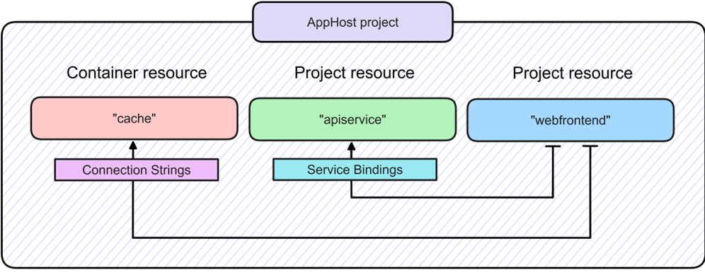
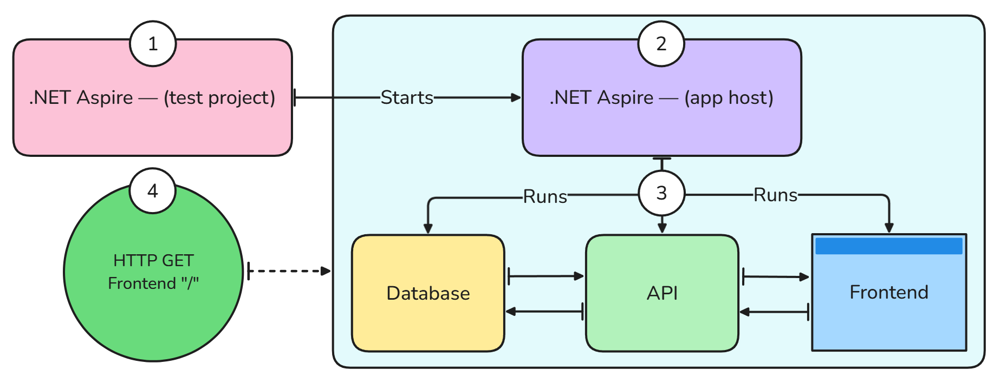
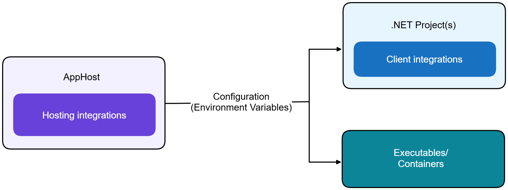
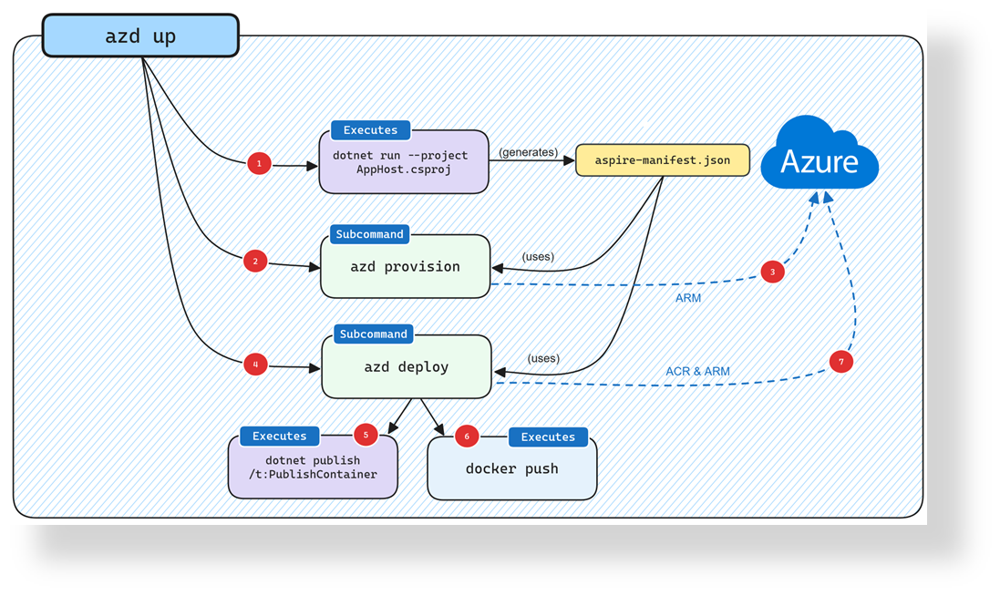

<!-- _footer: 'https://github.com/codebytes/build-with-aspire' -->

# Aspiring .NET with Azure OpenAI

## Chris Ayers


---


## Chris Ayers

### Senior Risk SRE<br>Azure CXP AzRel<br>Microsoft

<i class="fa-brands fa-bluesky"></i> BlueSky: [@chris-ayers.com](https://bsky.app/profile/chris-ayers.com)
<i class="fa-brands fa-linkedin"></i> LinkedIn: - [chris\-l\-ayers](https://linkedin.com/in/chris-l-ayers/)
<i class="fa fa-window-maximize"></i> Blog: [https://chris-ayers\.com/](https://chris-ayers.com/)
<i class="fa-brands fa-github"></i> GitHub: [Codebytes](https://github.com/codebytes)
<i class="fa-brands fa-mastodon"></i> Mastodon: [@Chrisayers@hachyderm.io](https://hachyderm.io/@Chrisayers)
~~<i class="fa-brands fa-twitter"></i> Twitter: @Chris_L_Ayers~~

---


# Agenda

- Why .NET Aspire?
- .NET Aspire Integrations
- Consuming Resources
- Local Azure Development
- Deploying to Azure
- **What's New in 9.3**
- Demos
- Q&A

---

# <!-- fit --> .NET Aspire is designed to improve the<br> experience of building .NET cloud-native apps

---

# Why .NET Aspire

<div class="columns3">
<div>

## Orchestration and Fundamentals

Simplify coordinating multiple services and resources in cloud-native applications

</div>
<div>

## Integrations

Connect seamlessly with Azure and third-party services with minimal configuration

</div>
<div>

## Tooling

Enhance the developer experience with powerful monitoring and debugging tools

</div>
</div>

---

# Orchestration and Fundamentals

<div class="columns">
<div>

- **Automated Service Management**: Coordinate multiple services seamlessly
- **Centralized Configuration**: Auto-manage keys and credentials
- **Simplified Containers**: Zero-friction configuration for ports and credentials

</div>
<div>

- **Observability**: Built-in logging, monitoring, and debugging
- **Multi-Container Support**: Efficient container coordination
- **Resource Lifecycle**: Predictable lifecycle events for all resources

</div>
</div>

---

# Integrations

<div class="columns">
<div>

- **Azure Services**: Seamless integration with Azure resources
- **Local Development**: Emulators and container support
- **Multi-Platform**: Support for various languages and platforms

</div>
<div>

- **Built-in Security**: Authentication and authorization
- **Community Ecosystem**: Growing toolkit of extensions
- **Simple Configuration**: Connect services with minimal code

</div>
</div>

---

# Tooling

<div class="columns">
<div>

- **IDE Integration**: Visual Studio and VS Code support
- **Project Templates**: Quickly start new Aspire projects
- **Dashboard**: Monitor and debug your applications

</div>
<div>

- **AppHost Project**: Central orchestration control
- **Service Defaults**: Consistent configuration across services
- **CLI Support**: Command-line development experience

</div>
</div>

---

# Orchestration and Fundamentals

---

# Core Fundamentals

<div class="columns">
<div>

- **Service Discovery**: Automatically connect your services
- **Configuration**: Standardized settings across your application
- **Custom Commands**: Extend and automate your development workflow

</div>
<div>

- **Health Checks**: Monitor service readiness and liveness
- **Telemetry**: Built-in logging and distributed tracing
- **Security**: Integrated authentication and authorization

</div>
</div>

---

# Service Defaults

<div class="columns">
<div>

- **Security Defaults**
  - Authentication with Azure AD
  - Secure secrets management
- **Resilience & Scalability**
  - Automatic retry policies
  - Circuit breakers for failure protection

</div>
<div>

- **Monitoring & Observability**
  - Pre-configured logging and tracing
  - Metrics collection for all services
  - Application insights integration

</div>
</div>

---

# Launch Profiles & Commands

<div class="columns">
<div>

- **Custom Commands**
  - Define workflow automation
  - Database migrations, data seeding
  - Development environment reset
  - Integrated with dashboard

</div>
<div>

- **Launch Profiles**
  - Configure service startup settings
  - Set environment variables and ports
  - Multiple profile support (local, cloud, test)
  - Simplified environment switching

</div>
</div>

---

# Health Checks & Telemetry

<div class="columns">
<div>

- **Health Checks**
  - Monitor service health
  - Dashboard visualization
  - Custom health endpoints
  - Azure monitoring

</div>
<div>

- **Telemetry**
  - Auto logs, traces, metrics
  - Distributed tracing
  - GitHub Copilot AI debugging (9.3)

</div>
</div>

---

# .NET Aspire Dashboard


---

# .NET Aspire Dashboard

<div class="columns">
<div>

- **Real-time Monitoring**: View all services and dependencies
- **Interactive Debugging**: Inspect logs and trace requests
- **Resource Management**: Control lifecycles of all components
- **Health Visualization**: Monitor service health at a glance

</div>
<div>

- **Structured Logs**: Filter and search across all services
- **Trace Visualization**: Track requests across service boundaries
- **Secret Management**: Configure secure credentials
- **Copilot AI Debugging**: Get intelligent troubleshooting (9.3)

</div>
</div>

---

# Service Discovery and Configuration

- **Automatic Configuration**: AppHost passes settings to services
- **Implicit Discovery**: Services reference only what they need
- **Named Endpoints**: Multiple endpoints per service
- **Environment Variables**: Structured configuration strings



---

# Testing in .NET Aspire

- **Integration Testing**: Test multiple components together
- **Container Testing**: Test with containerized services
- **Emulator Support**: Use local emulators for cloud services
- **End-to-End Testing**: Test full application workflows



---

# .NET Aspire Integrations



---

# The Two Sides to .NET Aspire Integrations

<div class="columns">
<div>

## Hosting Integrations

- Provision and manage resources
- Automate infrastructure setup
- Cloud-native functionality
- Integrated logging and monitoring
- Authentication and authorization
- Configuration management

</div>
<div>

## Client Integrations

- Configure service connections
- Consume hosted services
- Service discovery
- Service defaults
- Integrated logging and monitoring

</div>
</div>

---

# Official Integrations

<div class="columns">
<div>

## Cloud-Agnostic

- **Databases**: PostgreSQL, MySQL, MongoDB, SQL Server
- **Messaging**: Kafka, RabbitMQ, NATS
- **AI & Observability**: Ollama, Semantic Kernel, OpenTelemetry

</div>
<div>

## Cloud-Specific

- **Azure Services**: OpenAI, Cosmos DB, SQL, Redis, Key Vault, App Service, ACR, App Config
- **AWS Support**: Via Hosting.AWS package

</div>
</div>

---

# Community Toolkit Integrations

<div class="columns">
<div>

## Multi-Language Support

- **JavaScript**: Bun, Deno
- **Systems Programming**: Go, Rust
- **Enterprise**: Java/Spring
- **Extensions**: Node.js, SQL, MongoDB, Redis

</div>
<div>

## Additional Services

- **AI & Search**: Ollama, Meilisearch
- **Data**: SQLite, Data API Builder
- **Web**: Azure Static Web Apps emulator
- **Customization**: Advanced configurations

</div>
</div>

---

# Resource Management

<div class="columns">
<div>

- **Simple Connections**: Easily connect to Azure and third-party services
- **Automatic Configuration**: Service discovery and configuration management
- **Secret Handling**: Securely manage credentials, keys, and certificates

</div>
<div>

- **Environment Flexibility**: Same code works locally and in the cloud
- **Resource Abstraction**: Use existing Azure services or create new ones
- **Minimal Code**: Connect and configure with just a few lines of code

</div>
</div>

---

# Seamless Development Experience

<div class="columns">
<div>

- **Zero-Friction**: Local to cloud transitions
- **Emulator Support**: Local containers for speed
- **Auto Connections**: Managed connection strings
- **Hybrid Development**: Mix local/cloud resources

</div>
<div>

- **Resource Flexibility**: Use existing/new services
- **Example**: Azurite locally → Azure Blob in production
- **Consistent Code**: Works across environments
- **Environment Control**: Component-level targeting

</div>
</div>

---

# Microsoft.Extensions.AI

<div class="columns">
<div>

- **Unified API**: Common interface for AI providers
- **Pipeline Architecture**: Chain components efficiently
- **DI Integration**: Works with .NET service container
- **Provider-Agnostic**: Single interface, multiple backends

</div>
<div>

- **Local Development**: Connect to Ollama, LM Studio
- **Cloud Ready**: Same code for Azure OpenAI
- **Transport Options**: HTTP, gRPC, direct calls
- **Performance**: Auto-batching and throttling

</div>
</div>

---

# AI Local-to-Cloud Transitions

<div class="columns">
<div>

```csharp
// Local development with Ollama
builder.AddOllama("ollama")
    .WithModel("llama3");

// Add client to use the model
builder.Services.AddClientForOllama();
```

```csharp
// Single line change for production
builder.AddAzureOpenAI("ai")
    .WithModel("gpt-4o-mini");

// Same client code works unchanged
builder.Services.AddClientForAzureOpenAI();
```

</div>
<div>

- **Same Application Code**: Business logic remains identical
- **Configuration-Based Switching**: Environment determines provider
- **Consistent Capabilities**: Text completion, embeddings, image generation
- **Resource Integration**: Works with .NET Aspire's resource model
- **Example**: Use Ollama locally → Azure OpenAI in production

</div>
</div>

---

# Cloud Development

<div class="columns">
<div>

- **Azure App Service** (Preview, 9.3)
- **Azure Container Apps**
- **Kubernetes** (via improved manifest support)
- **Azure Container Registry**
  - Use existing ACR (9.3)
  - Integrate with multiple compute environments

</div>
<div>

- **Deployment Options**
  - Manual deployment
  - CI/CD pipelines
  - Azure Developer CLI (azd)
  - GitHub Actions & Azure DevOps
  - Terraform & Bicep

</div>
</div>

---

# Azure Authentication Options

<div class="columns">
<div>

- **Credential Providers**
  - AzureCli
  - AzurePowerShell
  - VisualStudio
  - VisualStudioCode
  - AzureDeveloperCli
  - InteractiveBrowser

</div>
<div>

- **Key Vault Integrations (9.3)**
  - Use existing Key Vault secrets
  - Inject as environment variables
  - Separate key/cert clients
  - Secure multi-app access

</div>
</div>

---

# Deploy and Configure Resources

<div class="columns">
<div>

- **In Visual Studio**
  - Azure provisioning built-in
  - Configure resources/groups
  - Deploy to compute targets
  - Monitor deployments

</div>
<div>

- **New Deployment Model (9.3)**
  - Per-resource publishing
  - Resource-to-compute mapping
  - Secure SQL multi-app access
  - Free tier SQL SKU default

</div>
</div>

---

# Deploying to Azure

<div class="columns">
<div>

- **New publisher model** (9.3)
  - Per-resource publishing
  - Resource-specific compute environments

- **Docker Compose & Kubernetes** (9.3)
  - Programmatic configuration control
  - Link parameters via environment variables

</div>
<div>

- **Parameter mapping for CI/CD** (9.3)
  - Exported as env vars/secrets
  - Consistent naming conventions
  - Interactive secret management

- **Azure integrations** (9.3)
  - Azure App Service
  - Use existing Azure Container Registry
  - Azure App Configuration support

</div>
</div>

---

# Azure Developer CLI Integration

- Native support for .NET Aspire deployments
- `azd init` auto-detects app structure
- **CI/CD Improvements (9.3)**
  - Simplified parameter handling
  - Clear naming conventions
  - Environment variable mapping



---

# Kubernetes Deployment (9.3)

<div class="columns">
<div>

- **Kubernetes Environment Support**
  - `AddKubernetesEnvironment("env")`
  - Configure global manifest settings
  - Per-resource customization
  - Strong typing for deployment definitions

</div>
<div>

```csharp
builder.AddKubernetesEnvironment("env")
       .WithProperties(env =>
       {
           env.DefaultImagePullPolicy = "Always";
       });

builder.AddContainer("service", "nginx")
       .PublishAsKubernetesService(resource =>
       {
           resource.Deployment!.Spec.RevisionHistoryLimit = 5;
       });
```

</div>
</div>

---

# Compute Environments (9.3)

<div class="columns">
<div>

- **Multiple Environment Support**
  - Deploy to different targets
  - Mix container/non-container
  - Support hybrid deployments
  - Resource-specific control

</div>
<div>

```csharp
// Support for explicit environment mapping
var k8s = builder.AddKubernetesEnvironment("k8s-env");
var compose = builder.AddDockerComposeEnvironment("docker-env");

builder.AddProject<Projects.Api>("api")
       .WithComputeEnvironment(compose);

builder.AddProject<Projects.Frontend>("frontend")
       .WithComputeEnvironment(k8s);
```

</div>
</div>

---

# What's New in .NET Aspire 9.3

<div class="columns3">
<div>

## App Model

- Easier container config
- Custom URLs
- YARP (Preview)
- New lifecycle events
- MySQL support
- Hidden resources

</div>
<div>

## Dashboard

- Copilot AI debugging
- Persistent filters
- Traces view
- Context menus
- Friendly names
- Metrics pause alert

</div>
<div>

## Deployment

- New publisher model
- Azure App Service
- Use existing ACR
- Improved CI/CD params
- Docker/K8s customization
- Better telemetry & security

</div>
</div>

---


# DEMOS

---

# Questions ?


---

# Resources

<div class="columns">
<div>

## Links

- [.NET Aspire](https://learn.microsoft.com/en-us/dotnet/aspire/get-started/aspire-overview)
- [What's new in .NET Aspire 9.3](https://learn.microsoft.com/en-us/dotnet/aspire/whats-new/aspire-9.3)
- [Aspirify](https://aspireify.net/)
- [Aspire Samples](https://github.com/dotnet/aspire-samples)
- [YARP Documentation](https://microsoft.github.io/reverse-proxy/)

</div>
<div>

## Follow Chris Ayers

<i class="fa-brands fa-bluesky"></i> BlueSky: [@chris-ayers.com](https://bsky.app/profile/chris-ayers.com)
<i class="fa-brands fa-linkedin"></i> LinkedIn: - [chris\-l\-ayers](https://linkedin.com/in/chris-l-ayers/)
<i class="fa fa-window-maximize"></i> Blog: [https://chris-ayers\.com/](https://chris-ayers.com/)
<i class="fa-brands fa-github"></i> GitHub: [Codebytes](https://github.com/codebytes)
<i class="fa-brands fa-mastodon"></i> Mastodon: [@Chrisayers@hachyderm.io](https://hachyderm.io/@Chrisayers)
~~<i class="fa-brands fa-twitter"></i> Twitter: @Chris_L_Ayers~~

</div>

</div>

<!-- Needed for mermaid, can be anywhere in file except frontmatter -->
<script type="module">
  import mermaid from 'https://cdn.jsdelivr.net/npm/mermaid@10/dist/mermaid.esm.min.mjs';
  mermaid.initialize({ startOnLoad: true });
</script>
