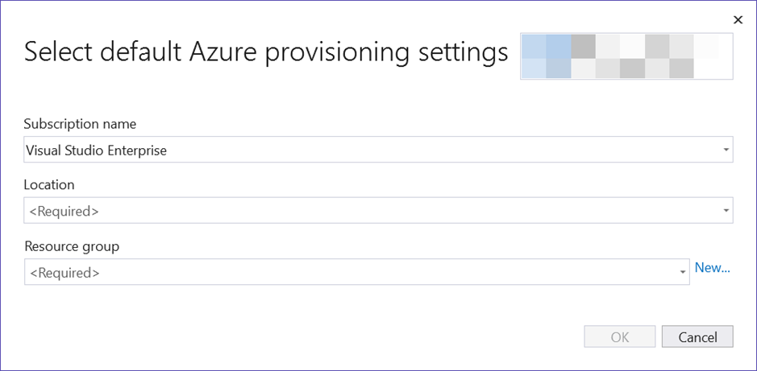

<!-- _footer: 'https://github.com/codebytes/build-with-aspire' -->

# Aspiring .NET with Azure OpenAI

## Chris Ayers

---

## Chris Ayers

### Senior Risk SRE Azure CXP AzRel Microsoft

<i class="fa-brands fa-bluesky"></i> BlueSky: [@chris-ayers.com](https://bsky.app/profile/chris-ayers.com)
<i class="fa-brands fa-linkedin"></i> LinkedIn: - [chris\-l\-ayers](https://linkedin.com/in/chris-l-ayers/)
<i class="fa fa-window-maximize"></i> Blog: [https://chris-ayers\.com/](https://chris-ayers.com/)
<i class="fa-brands fa-github"></i> GitHub: [Codebytes](https://github.com/codebytes)
<i class="fa-brands fa-mastodon"></i> Mastodon: [@Chrisayers@hachyderm.io](https://hachyderm.io/@Chrisayers)
~~<i class="fa-brands fa-twitter"></i> Twitter: @Chris_L_Ayers~~

---

# Agenda

- Why .NET Aspire?
- .NET Aspire Integrations
- Consuming Resources
- Local Azure Development
- Deploying to Azure
- **What's New in 9.3**
- Demos
- Q&A

---

# <!-- fit --> .NET Aspire is designed to improve the  experience of building .NET cloud-native apps

---

# Why .NET Aspire

## Orchestration and Fundamentals

Simplify coordinating multiple services and resources in cloud-native applications

## Integrations

Connect seamlessly with Azure and third-party services with minimal configuration

## Tooling

Enhance the developer experience with powerful monitoring and debugging tools

---

# Orchestration and Fundamentals

- **Automated Service Management**: Coordinate multiple services seamlessly
- **Centralized Configuration**: Auto-manage keys and credentials
- **Simplified Containers**: Zero-friction configuration for ports and credentials

- **Observability**: Built-in logging, monitoring, and debugging
- **Multi-Container Support**: Efficient container coordination
- **Resource Lifecycle**: Predictable lifecycle events for all resources

---

# Integrations

- **Azure Services**: Seamless integration with Azure resources
- **Local Development**: Emulators and container support
- **Multi-Platform**: Support for various languages and platforms

- **Built-in Security**: Authentication and authorization
- **Community Ecosystem**: Growing toolkit of extensions
- **Simple Configuration**: Connect services with minimal code

---

# Tooling

- **IDE Integration**: Visual Studio and VS Code support
- **Project Templates**: Quickly start new Aspire projects
- **Dashboard**: Monitor and debug your applications

- **AppHost Project**: Central orchestration control
- **Service Defaults**: Consistent configuration across services
- **CLI Support**: Command-line development experience

---

# Orchestration and Fundamentals

---

# Core Fundamentals

- **Service Discovery**: Automatically connect your services
- **Configuration**: Standardized settings across your application
- **Custom Commands**: Extend and automate your development workflow

- **Health Checks**: Monitor service readiness and liveness
- **Telemetry**: Built-in logging and distributed tracing
- **Security**: Integrated authentication and authorization

---

# Service Defaults

- **Security Defaults**
  - Authentication with Azure AD
  - Secure secrets management
- **Resilience & Scalability**
  - Automatic retry policies
  - Circuit breakers for failure protection

- **Monitoring & Observability**
  - Pre-configured logging and tracing
  - Metrics collection for all services
  - Application insights integration

---

# Launch Profiles & Commands

- **Custom Commands**
  - Define workflow automation
  - Database migrations, data seeding
  - Development environment reset
  - Integrated with dashboard

- **Launch Profiles**
  - Configure service startup settings
  - Set environment variables and ports
  - Multiple profile support (local, cloud, test)
  - Simplified environment switching

---

# Health Checks & Telemetry

- **Health Checks**
  - Monitor service readiness and liveness
  - Dashboard integration for visualization
  - Custom health endpoints for APIs
  - Azure monitoring integration

- **Telemetry**
  - Automatic logs, traces, metrics collection
  - Distributed tracing across services
  - GitHub Copilot AI debugging (9.3)

---

# .NET Aspire Dashboard

---

# .NET Aspire Dashboard

- **Real-time Monitoring**: View all services and dependencies
- **Interactive Debugging**: Inspect logs and trace requests
- **Resource Management**: Control lifecycles of all components
- **Health Visualization**: Monitor service health at a glance

- **Structured Logs**: Filter and search across all services
- **Trace Visualization**: Track requests across service boundaries
- **Secret Management**: Configure secure credentials
- **Copilot AI Debugging**: Get intelligent troubleshooting (9.3)

---

# Service Discovery and Configuration

- **Automatic Configuration**: AppHost passes settings to services
- **Implicit Discovery**: Services reference only what they need
- **Named Endpoints**: Multiple endpoints per service
- **Environment Variables**: Structured configuration strings

---

# .NET Aspire Integrations

---

# The Two Sides to .NET Aspire Integrations

## Hosting Integrations

- Provision and manage resources
- Automate infrastructure setup
- Cloud-native functionality
- Integrated logging and monitoring
- Authentication and authorization
- Configuration management

## Client Integrations

- Configure service connections
- Consume hosted services
- Service discovery
- Service defaults
- Integrated logging and monitoring

> Hosting integrations extend IDistributedApplicationBuilder; Client integrations extend IHostApplicationBuilder

---

# Official Integrations

## Cloud-Agnostic

- **Databases**: PostgreSQL, MySQL, MongoDB, SQL Server
- **Messaging**: Kafka, RabbitMQ, NATS
- **AI & Observability**: Ollama, Semantic Kernel, OpenTelemetry

## Cloud-Specific

- **Azure Services**: OpenAI, Cosmos DB, SQL, Redis, Key Vault
- **Latest Azure (9.3)**: App Service, ACR, App Config
- **AWS Support**: Via Hosting.AWS package

---

# Community Toolkit Integrations

## Multi-Language Support

- **JavaScript**: Bun, Deno
- **Systems Programming**: Go, Rust
- **Enterprise**: Java/Spring
- **Extensions**: Node.js, SQL, MongoDB, Redis

## Additional Services

- **AI & Search**: Ollama, Meilisearch
- **Data**: SQLite, Data API Builder
- **Web**: Azure Static Web Apps emulator
- **Customization**: Advanced configurations

---

# Consuming Resources

- **Simple Connections**: Easily connect to Azure and third-party services
- **Automatic Configuration**: Service discovery and configuration management
- **Secure Credentials**: Managed identities and credential handling

- **Secret Management**: Inject secrets, keys, and certificates automatically
- **Centralized Config**: Manage application settings in one place
- **Minimal Code**: Connect to services with just a few lines of code

---

# Local vs Cloud Resources

- Develop locally with emulators or local containers
- Seamlessly switch to real Azure resources for staging/production
- Aspire manages configuration and connection strings
- Example: Use Azurite for local Blob Storage, then switch to Azure Blob in cloud

---

# Local Azure Development

---

# Azure provisioning credential store

- AzureCli
- AzurePowerShell
- VisualStudio
- VisualStudioCode
- AzureDeveloperCli
- InteractiveBrowser

---

# Deploy and Configure Resources

In Visual Studio

---

# Deploying to Azure

- **New publisher model: per-resource publishing, not global (9.3)**
- **Explicit mapping of resources to compute environments (9.3)**
- **Docker Compose & Kubernetes manifest customization via C# APIs (9.3)**
- **Parameter mapping for CI/CD: parameters exported as env vars/secrets, no more AZD_INITIAL_ENVIRONMENT_CONFIG (9.3)**
- **Azure App Service (Preview) support (9.3)**
- **Use existing Azure Container Registry (ACR) (9.3)**
- **Secure multi-app access to Azure SQL, default SQL SKU is now Free (9.3)**

---

# Azure Developer CLI

Native support for deploying .NET Aspire projects.
`azd init` initializes a project by inspecting the directory structure to determine the app type.
`azd` runs the AppHost to generate the Aspire manifest file.
The generated manifest is used by azd's provision command to create Bicep files in-memory.

- **Smarter app host discovery: CLI finds the app host from any directory (9.3)**
- **Health-aware dashboard launch: waits for dashboard to be ready before showing URL (9.3)**
- **CI/CD improvements: parameters and secrets mapped directly, interactive secret management (9.3)**

---

# What's New in .NET Aspire

- **Improved Containers**: Zero-friction configuration and YARP integration
- **Enhanced Dashboard**: AI debugging and persistent filters
- **Flexible Deployment**: New publisher model and manifest customization

- **Azure Integration**: App Service support and expanded cloud services
- **CI/CD Improvements**: Better parameter mapping and secret management
- **Developer Experience**: Smarter app host discovery and health-aware launch

---

# DEMOS

---

# Questions ?

---

# Resources

## Links

- [.NET Aspire](https://learn.microsoft.com/en-us/dotnet/aspire/get-started/aspire-overview)
- [What's new in .NET Aspire 9.3](https://learn.microsoft.com/en-us/dotnet/aspire/whats-new/aspire-9.3)
- [Aspirify](https://aspireify.net/)
- [Aspire Samples](https://github.com/dotnet/aspire-samples)
- [YARP Documentation](https://microsoft.github.io/reverse-proxy/)

## Follow Chris Ayers

<i class="fa-brands fa-bluesky"></i> BlueSky: [@chris-ayers.com](https://bsky.app/profile/chris-ayers.com)
<i class="fa-brands fa-linkedin"></i> LinkedIn: - [chris\-l\-ayers](https://linkedin.com/in/chris-l-ayers/)
<i class="fa fa-window-maximize"></i> Blog: [https://chris-ayers\.com/](https://chris-ayers.com/)
<i class="fa-brands fa-github"></i> GitHub: [Codebytes](https://github.com/codebytes)
<i class="fa-brands fa-mastodon"></i> Mastodon: [@Chrisayers@hachyderm.io](https://hachyderm.io/@Chrisayers)
~~<i class="fa-brands fa-twitter"></i> Twitter: @Chris_L_Ayers~~

<!-- Needed for mermaid, can be anywhere in file except frontmatter -->

